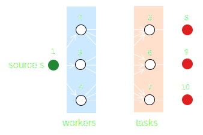

# Problem Set 3 (PS3): Modified Bellman-Ford Algorithm for Single-Source Shortest Paths with Node Capacities
This problem set will introduce [the Bellman-Ford algorithm](https://en.wikipedia.org/wiki/Bellman–Ford_algorithm) for finding the shortest path from a single source vertex to all other vertices in a weighted graph. 
It is an extension of `Lab-6d` in which we introduce node capacities.

The [Bellman-Ford algorithm](https://en.wikipedia.org/wiki/Bellman–Ford_algorithm) is a graph search algorithm that can search graphs with negative edge weights. However, it is slower than Dijkstra's algorithm. Bellman-Ford has a time complexity of $\mathcal{O}(|\mathcal{V}|\cdot|\mathcal{E}|)$, where $|\mathcal{V}|$ is the number of vertices and $|\mathcal{E}|$ is the number of edges in the graph.

## Problem: Update your Bellman-Ford to consider Node Capacities
Update [your initial Bellman-Ford algorithm](https://en.wikipedia.org/wiki/Bellman–Ford_algorithm) to find the shortest path from a single source vertex to all other vertices in a weighted graph where we consider node capacities.

<div>
    <center>
        
    </center>
</div>

Imagine you (node `1`) are in charge of allocating workers to tasks, i.e., faculty to courses. You have a list of faculty and a list of courses. While each faculty member can teach any course, they have a preference for each course reflected in the edge weight connecting faculty to classes. 
* The weight of the edge connecting faculty `i` to course `j` is the cost of assigning faculty `i` to course `j.` If $w_{ij} < 0$, it means that faculty `i` prefers course `j`. If $w_{ij} > 0$, it means that faculty `i` dislikes course `j`. If $w_{ij} = 0$, it means that faculty `i` is indifferent to course `j.`
* Node capacities: each faculty member can be assigned from `0` upto a maximum of `N` courses. This value is specified in the `data/Bipartite.nodecapacity` file.

### Tasks
1. Implement the `readnodecapacityfile(filepath::String; comment::Char='#', 
    delim::Char=',')::Dict{Int64, Tuple{Int64, Int64}}` function to read the node capacities from the file. This method is in the `src/Files.jl` file.
2. `Update` the `_search(graph::T, start::MyGraphNodeModel, algorithm::BellmanFordAlgorithm)` method in the `src/Search.jl` file to consider node capacities.


## Test your Bellman-Ford with Node Capacities
In this task, we'll test your implementation of [the Bellman-Ford algorithm](https://en.wikipedia.org/wiki/Bellman–Ford_algorithm) using a test case that is similar to problem set 3 (PS3).


We want to assign faculty members to courses in a way that minimizes the cost of the assignment. Later, we'll solve this problem using [Linear Programming](https://en.wikipedia.org/wiki/Linear_programming). However, let's try to solve this problem using [the Bellman-Ford algorithm](https://en.wikipedia.org/wiki/Bellman–Ford_algorithm) and see what happens.

Let's specify different weights for the edges connecting faculty to courses, solve the problem, and look at the solution. The graph and weights are specified in the `data/Bipartite.edgelist` file. The file has the following format:
* Each record has the fields: `source,` `target,` `cost,` `lb capacity,` `ub capacity`

Execute the `runme_balanced_bellmanford.jl` script to solve the problem and visualize the results:

```julia
include("runme_balanced_bellmanford.jl")
```

